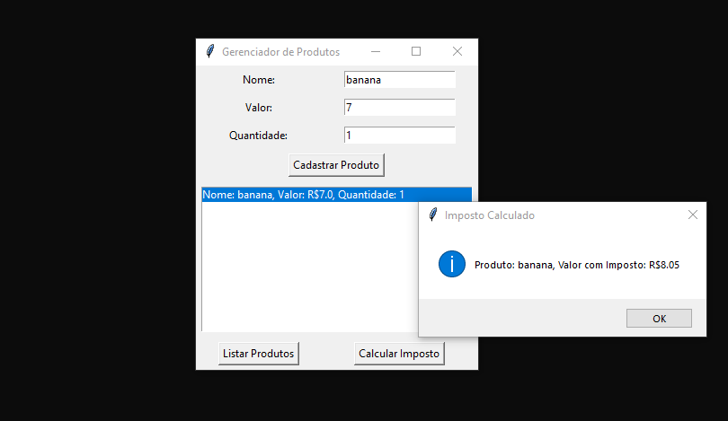

# Gerenciador-de-Produtos-Em-Python
Um projeto simples da faculdade usando o Python e Tkinter

# Gerenciador de Produtos em Python 🍎🍌🍓

Este é um projeto simples desenvolvido durante a faculdade, utilizando **Python** e **Tkinter**. O objetivo do programa é permitir que o usuário registre frutas, informe o valor e a quantidade de cada uma, e visualize uma lista das frutas já cadastradas.

## Funcionalidades

- **Cadastro de frutas**: O usuário pode adicionar frutas ao sistema, informando o nome, valor e quantidade de cada item.
- **Visualização da lista de frutas**: Uma vez adicionadas, as frutas podem ser visualizadas em uma lista interativa.
- **Cálculo de imposto**: Ao selecionar uma fruta da lista, o usuário pode clicar em um botão para calcular o valor do imposto sobre o produto selecionado.

Este programa é uma maneira prática de gerenciar frutas e calcular impostos de maneira simples, utilizando a interface gráfica oferecida pelo Tkinter.

